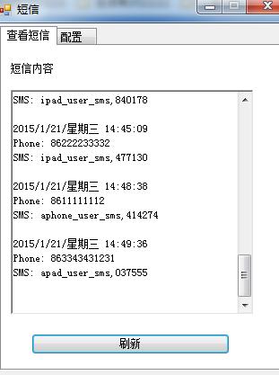

## 读取短信网关模拟器发送的短信内容

** 这部分是放在短信网关模拟器的PC上运行的 **

### 干什么的

测试短信认证时，要使用短信网关模拟器来获取校验码，查看校验码比较麻烦，这里将短信网关模拟器里的信息过滤一下，只显示手机号和短信等关键信息。

### 抓包

VPN设备会给短信网关发送一些东西，包括用户的手机号码和要发送的内容等等，然后短信网关去把这些内容发送到指定的手机上。

这部分的功能就是把VPN发来的东西，解析出来，找到需要的手机号和短信内容。

使用[ffi-pcap](https://github.com/sophsec/ffi-pcap)抓包，然后解析。

### 发送

将VPN发来的手机号和短信解析出来后，需要把这些信息发到自己的PC上，使用TCP发送，自己PC要开一个TCP Server端(在[这里](http://200.200.0.36/86194/sms_receive/tree/master)),然后就行了

### 其他

其实，可以直接从VPN设备拿到所需的所有信息。。